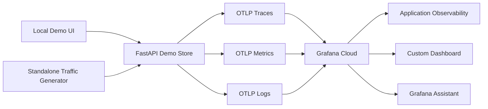
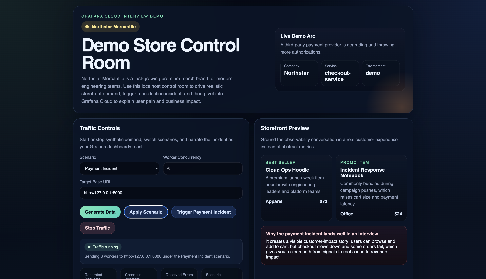
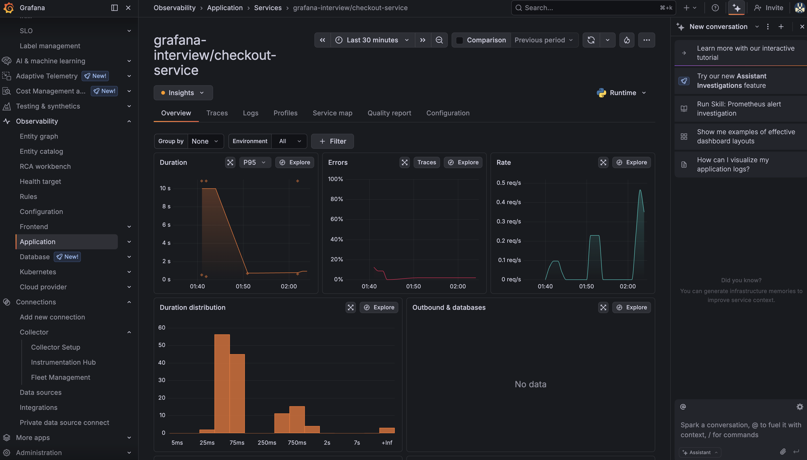
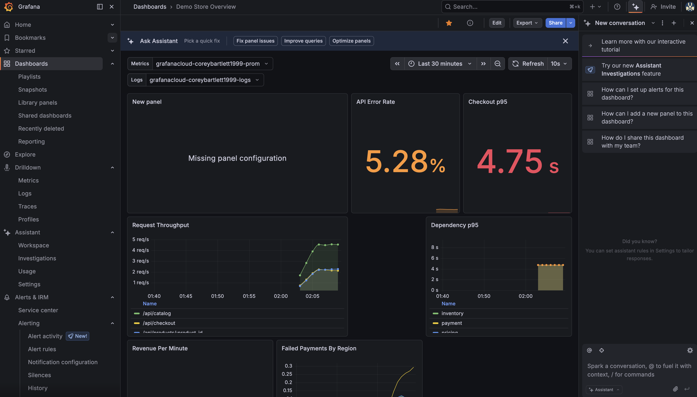

# Grafana Cloud Demo Store

This is a small ecommerce-style service instrumented with OpenTelemetry and wired for Grafana Cloud.
It is designed to be easy to run locally, generate realistic telemetry, and demonstrate traces, metrics,
and logs working together around a checkout flow.

The demo is centered on **Northstar Mercantile**, a fictional premium ecommerce brand for engineering teams.
The service models a customer-critical checkout path with realistic browse traffic, checkout attempts, payment failures,
and dependency latency so the resulting telemetry feels closer to a production workload than a toy app.

- realistic HTTP traffic instead of a hello-world app
- a localhost control room UI for a polished live demo
- traces that break checkout into inventory, pricing, shipping, and payment spans
- business metrics like checkout outcomes, revenue, and failed payments
- logs correlated with traces so you can pivot from a failure to the related trace
- a traffic generator to keep the dashboard populated during a demo

## What it includes

- a FastAPI checkout service with browse, product, and checkout endpoints
- direct OTLP export to Grafana Cloud for traces, metrics, and logs
- a localhost control room UI for scenario-driven traffic generation
- a custom Grafana dashboard JSON for demo visualization
- multiple scenarios such as steady state, payment incident, inventory hotspot, and flash sale

## Demo domain

Northstar Mercantile sells premium apparel, office goods, and engineering-themed merchandise.
The demo focuses on the checkout-service because it is the most operationally sensitive part of the customer journey:

- browse and product lookups create normal background traffic
- checkout spans break down into inventory, pricing, shipping, and payment work
- payment degradation and authorization failures create a realistic incident pattern
- business metrics make it possible to relate technical regressions to checkout success and revenue

## Architecture



## Screenshots

### Local control room



### Grafana Cloud Application Observability



### Custom dashboard



## Project layout

- `app/main.py`: FastAPI service and business logic
- `app/demo_control.py`: live scenario and traffic controls
- `app/ui.py`: localhost control room UI
- `app/telemetry.py`: OpenTelemetry setup for traces, metrics, and logs
- `docs/technical-walkthrough.md`: one-page architecture and implementation overview
- `traffic.py`: synthetic load generator
- `dashboard/storefront-overview.json`: importable Grafana dashboard
- `.env.example`: Grafana Cloud OTLP environment variable template

## Prerequisites

Before running the demo, make sure you have the following:

- Python `3.12` or newer
- a Grafana Cloud account
- internet access so the app can export telemetry to Grafana Cloud
- a modern web browser for the localhost control room and Grafana Cloud UI

Optional but helpful tools:

- `uv` for fast Python environment setup
- `make` for shortcut commands such as `make run`
- `git` if you plan to clone the repository instead of downloading it as a ZIP

### Python

This project requires Python `>=3.12`.

You can verify your version with:

```bash
python3 --version
```

If you need Python, download it from the official site:

- [python.org/downloads](https://www.python.org/downloads/)

### Grafana Cloud account

If you do not already have a Grafana Cloud account:

1. Go to [grafana.com/products/cloud](https://grafana.com/products/cloud/).
2. Click `Create free account`.
3. Complete the account setup flow.
4. Open your Cloud Portal and create or access your Grafana Cloud stack.
5. In the stack UI, go to `Connections -> OpenTelemetry -> Configure` to get the OTLP endpoint and headers used by this demo.

Grafana documentation references:

- [Create a Grafana Cloud account](https://grafana.com/docs/grafana-cloud/get-started/create-account/)
- [Get started with Grafana Cloud](https://grafana.com/docs/grafana-cloud/get-started/)

### How to get the project

You can use this repository in either of these ways:

- clone it with `git clone`
- download the repository as a ZIP from GitHub and extract it locally

If you download the repository as a ZIP, open a terminal in the extracted `grafana-cloud-demo-store` directory and follow the same setup instructions below.

## Quick Start

1. Clone the repository and enter it:

```bash
git clone https://github.com/coreymb99/grafana-cloud-demo-store.git
cd grafana-cloud-demo-store
```

2. Create the environment.

With `uv`:

```bash
uv sync
```

Or use the included shortcut:

```bash
make setup
```

Or with standard Python tools:

```bash
python3 -m venv .venv
. .venv/bin/activate
pip install -e .
```

Or use:

```bash
make setup-venv
```

3. Copy the environment template:

```bash
cp .env.example .env
```

The template includes safe defaults for service metadata such as:

- `OTEL_SERVICE_NAME=checkout-service`
- `SERVICE_NAMESPACE=northstar-mercantile`
- `DEPLOYMENT_ENVIRONMENT=demo`

You should replace the OTLP endpoint and headers in `.env` with the values from your own Grafana Cloud stack.

4. In Grafana Cloud, open your stack and go to:

- `Connections`
- `OpenTelemetry`
- `Configure`

Copy the values for:

- `OTEL_EXPORTER_OTLP_PROTOCOL`
- `OTEL_EXPORTER_OTLP_ENDPOINT`
- `OTEL_EXPORTER_OTLP_HEADERS`

Grafana’s OTLP docs note that for Python, the authorization header should use `Basic%20` instead of `Basic `.

5. Run the API and open the demo console:

With `uv`:

```bash
set -a
source .env
set +a
uv run demo-store
```

Or with the virtualenv created above:

```bash
set -a
source .env
set +a
.venv/bin/demo-store
```

Or use:

```bash
make run
```

Then open the local UI:

`http://127.0.0.1:8000`

That address is the default local URL for this project because the service binds to port `8000` unless `PORT` is overridden.
If you start the service on a different port, open the matching local URL instead and update the control room base URL or `DEMO_STORE_URL` accordingly.

The built-in control room lets you:

- start or stop data generation without a second terminal
- switch scenarios like steady state, payment incident, inventory hotspot, and flash sale
- trigger a one-click payment incident
- show live request, checkout, and error counters

6. Optional: if you want a terminal-only mode instead of the built-in UI, use the standalone generator in another shell:

```bash
set -a
source .env
set +a
.venv/bin/demo-traffic
```

Or use:

```bash
make traffic
```

## Runtime Notes

The localhost UI can change scenarios live without restarting the service. The terminal traffic generator remains available for scripted or headless use.

Default runtime behavior:

- the API binds to `127.0.0.1`/`0.0.0.0` on port `8000` unless `PORT` is set
- the control room assumes the API is available at `http://127.0.0.1:8000` unless you change the base URL in the UI
- the standalone traffic generator uses `DEMO_STORE_URL`, which defaults to `http://127.0.0.1:8000`

## Configuration Reference

| Variable | Required | Default | Purpose |
| --- | --- | --- | --- |
| `OTEL_SERVICE_NAME` | No | `checkout-service` | Service name shown in Grafana Cloud |
| `SERVICE_NAMESPACE` | No | `northstar-mercantile` | Service namespace used for grouping and Application Observability |
| `SERVICE_VERSION` | No | `0.1.0` | Service version resource attribute |
| `DEPLOYMENT_ENVIRONMENT` | No | `demo` | Environment resource attribute |
| `OTEL_EXPORTER_OTLP_PROTOCOL` | Yes | `http/protobuf` in `.env.example` | OTLP transport protocol |
| `OTEL_EXPORTER_OTLP_ENDPOINT` | Yes | example value in `.env.example` | Grafana Cloud OTLP gateway base URL |
| `OTEL_EXPORTER_OTLP_HEADERS` | Yes | example placeholder in `.env.example` | OTLP auth header, usually `Authorization=Basic%20...` |
| `PORT` | No | `8000` | Local port for the FastAPI service |
| `HOST` | No | `0.0.0.0` | Bind address for the FastAPI service |
| `DEMO_STORE_URL` | No | `http://127.0.0.1:8000` | Base URL used by the standalone traffic generator |
| `LOG_LEVEL` | No | `INFO` | Log verbosity |

Scenario behavior is controlled from the localhost UI and does not require environment variable changes during normal demo use.

## Dashboard import

Import `dashboard/storefront-overview.json` into Grafana and bind:

- the Prometheus/Mimir data source to the `Metrics` variable
- the Loki data source to the `Logs` variable

If a metric name looks slightly different in your stack, open Explore and search for `storefront_`. Grafana Cloud converts OpenTelemetry metric names to Prometheus-compatible names by replacing `.` or `-` with `_` and adding standard suffixes such as `_total` or `_seconds`.

## Repository Usage

This repository is self-contained. No machine-specific paths are required.

- configuration is provided through environment variables in `.env`
- by default, the service runs at `http://127.0.0.1:8000` unless `PORT` is overridden
- the dashboard JSON ships in the repository under `dashboard/`
- common workflows are exposed through `make help`, `make run`, and `make traffic`

## Troubleshooting

### No data appears in Grafana Cloud

- verify that `.env` contains your real `OTEL_EXPORTER_OTLP_ENDPOINT` and `OTEL_EXPORTER_OTLP_HEADERS`
- confirm that the service is running and traffic is being generated
- check the service logs for OTLP export errors such as `401 Unauthorized`

### Traces appear, but Application Observability is empty

- confirm the service is sending resource attributes such as `service.name`, `service.namespace`, and `deployment.environment`
- verify that the service is running long enough for Grafana Cloud to build the derived application views
- check that the service namespace and environment values are consistent across runs

### The localhost control room loads, but buttons do not generate traffic

- make sure the API is actually running on the same port shown in the UI
- if you changed `PORT`, update the base URL in the control room
- if you are using the standalone generator, set `DEMO_STORE_URL` to the same host and port as the API

### Dashboard panels are blank

- confirm the correct Grafana Cloud Prometheus/Mimir and Loki data sources were selected during import
- widen the time range to `Last 30 minutes` or `Last 1 hour`
- search for `storefront_` in Explore to validate that the metrics are present

### OTLP authentication errors

- ensure the header uses the value generated by Grafana Cloud
- for Python, the header should typically use `Basic%20...` in the environment variable
- if credentials were rotated, update `.env` and restart the service

## Suggested Grafana Assistant prompts

Use prompts like these once data is flowing:

1. `Why did checkout latency spike in the last 15 minutes?`
2. `Which dependency is contributing most to checkout p95 latency?`
3. `Are payment failures concentrated in one region or customer tier?`
4. `Show me traces related to recent payment_failed logs.`
5. `Did revenue drop when checkout errors increased?`
6. `Compare enterprise checkout latency to trial users over the last 30 minutes.`

## References

- Grafana Cloud OTLP endpoint docs: <https://grafana.com/docs/grafana-cloud/send-data/otlp/send-data-otlp/>
- OTLP format considerations: <https://grafana.com/docs/grafana-cloud/send-data/otlp/otlp-format-considerations/>
