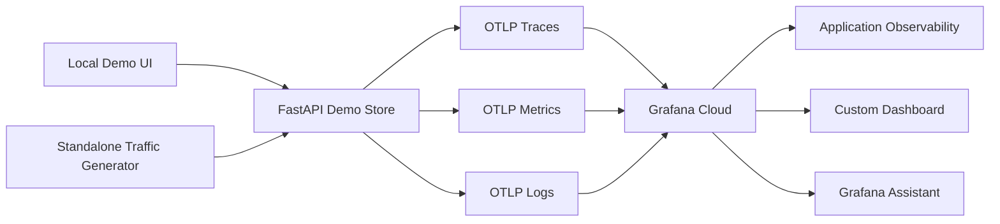

# Grafana Cloud Demo Store

This is a small ecommerce-style service instrumented with OpenTelemetry and wired for Grafana Cloud.
It is designed to be easy to run locally, generate realistic telemetry, and demonstrate traces, metrics,
and logs working together around a checkout flow.

- realistic HTTP traffic instead of a hello-world app
- a localhost control room UI for a polished live demo
- traces that break checkout into inventory, pricing, shipping, and payment spans
- business metrics like checkout outcomes, revenue, and failed payments
- logs correlated with traces so you can pivot from a failure to the related trace
- a traffic generator to keep the dashboard populated during a demo

## What it includes

- a FastAPI checkout service with browse, product, and checkout endpoints
- direct OTLP export to Grafana Cloud for traces, metrics, and logs
- a localhost control room UI for scenario-driven traffic generation
- a custom Grafana dashboard JSON for demo visualization
- multiple scenarios such as steady state, payment incident, inventory hotspot, and flash sale

## Architecture



## Project layout

- `app/main.py`: FastAPI service and business logic
- `app/demo_control.py`: live scenario and traffic controls
- `app/ui.py`: localhost control room UI
- `app/telemetry.py`: OpenTelemetry setup for traces, metrics, and logs
- `traffic.py`: synthetic load generator
- `dashboard/storefront-overview.json`: importable Grafana dashboard
- `.env.example`: Grafana Cloud OTLP environment variable template

## Quick Start

1. Clone the repository and enter it:

```bash
git clone https://github.com/coreymb99/grafana-cloud-demo-store.git
cd grafana-cloud-demo-store
```

2. Create the environment.

With `uv`:

```bash
uv sync
```

Or use the included shortcut:

```bash
make setup
```

Or with standard Python tools:

```bash
python3 -m venv .venv
. .venv/bin/activate
pip install -e .
```

Or use:

```bash
make setup-venv
```

3. Copy the environment template:

```bash
cp .env.example .env
```

4. In Grafana Cloud, open your stack and go to:

- `Connections`
- `OpenTelemetry`
- `Configure`

Copy the values for:

- `OTEL_EXPORTER_OTLP_PROTOCOL`
- `OTEL_EXPORTER_OTLP_ENDPOINT`
- `OTEL_EXPORTER_OTLP_HEADERS`

Grafana’s OTLP docs note that for Python, the authorization header should use `Basic%20` instead of `Basic `.

5. Run the API and open the demo console:

With `uv`:

```bash
set -a
source .env
set +a
uv run demo-store
```

Or with the virtualenv created above:

```bash
set -a
source .env
set +a
.venv/bin/demo-store
```

Or use:

```bash
make run
```

Then open the local UI:

`http://127.0.0.1:8000`

The built-in control room lets you:

- start or stop data generation without a second terminal
- switch scenarios like steady state, payment incident, inventory hotspot, and flash sale
- trigger a one-click payment incident
- show live request, checkout, and error counters

6. Optional: if you want a terminal-only mode instead of the built-in UI, use the standalone generator in another shell:

```bash
set -a
source .env
set +a
.venv/bin/demo-traffic
```

Or use:

```bash
make traffic
```

## Runtime Notes

The localhost UI can change scenarios live without restarting the service. The terminal traffic generator remains available for scripted or headless use.

## Dashboard import

Import `dashboard/storefront-overview.json` into Grafana and bind:

- the Prometheus/Mimir data source to the `Metrics` variable
- the Loki data source to the `Logs` variable

If a metric name looks slightly different in your stack, open Explore and search for `storefront_`. Grafana Cloud converts OpenTelemetry metric names to Prometheus-compatible names by replacing `.` or `-` with `_` and adding standard suffixes such as `_total` or `_seconds`.

## Repository Usage

This repository is self-contained. No machine-specific paths are required.

- configuration is provided through environment variables in `.env`
- the default local service URL is `http://127.0.0.1:8000`
- the dashboard JSON ships in the repository under `dashboard/`
- common workflows are exposed through `make help`, `make run`, and `make traffic`

## Suggested Grafana Assistant prompts

Use prompts like these once data is flowing:

1. `Why did checkout latency spike in the last 15 minutes?`
2. `Which dependency is contributing most to checkout p95 latency?`
3. `Are payment failures concentrated in one region or customer tier?`
4. `Show me traces related to recent payment_failed logs.`
5. `Did revenue drop when checkout errors increased?`
6. `Compare enterprise checkout latency to trial users over the last 30 minutes.`

## References

- Grafana Cloud OTLP endpoint docs: <https://grafana.com/docs/grafana-cloud/send-data/otlp/send-data-otlp/>
- OTLP format considerations: <https://grafana.com/docs/grafana-cloud/send-data/otlp/otlp-format-considerations/>
