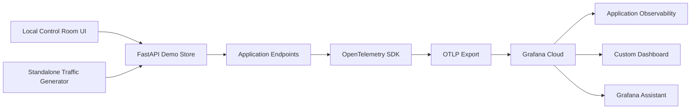

# Northstar Mercantile Demo

## Purpose

This demo shows a small ecommerce checkout service instrumented with OpenTelemetry and connected to Grafana Cloud.
The goal is to demonstrate how traces, metrics, and logs can be generated from a realistic application flow and then used in Grafana Cloud to investigate latency, failures, and customer impact.

## Architecture

High-level flow:

`Python client -> FastAPI service -> OpenTelemetry SDK -> OTLP -> Grafana Cloud`

More complete flow:

`Local demo UI / traffic generator -> FastAPI checkout service -> spans, metrics, and logs emitted by OpenTelemetry -> OTLP export -> Grafana Cloud dashboards, Application Observability, and Grafana Assistant`

## Components

### 1. Traffic generation

The demo has two ways to generate activity:

- a localhost control room UI with buttons for starting traffic and switching scenarios
- a standalone Python traffic generator for scripted or terminal-driven traffic

This makes it easy to create both steady-state behavior and incident conditions without modifying code during the demo.

### 2. FastAPI application

The core application is a Python FastAPI service that models a simple ecommerce flow:

- `GET /api/catalog`
- `GET /api/products/{product_id}`
- `POST /api/checkout`

The checkout path is where most of the observability value lives. It simulates:

- inventory reservation
- pricing calculation
- shipping quote lookup
- payment authorization

These are intentionally modeled as separate steps so they appear clearly in traces and can be discussed as dependencies.

### 3. OpenTelemetry instrumentation

The service is instrumented with the OpenTelemetry Python SDK and exports directly to Grafana Cloud over OTLP HTTP.

Telemetry includes:

- traces for request flow and dependency spans
- custom business and operational metrics
- logs correlated with trace and span identifiers

Important resource attributes:

- `service.name=checkout-service`
- `service.namespace=northstar-mercantile`
- `deployment.environment=demo`

These attributes help Grafana Cloud group and surface the service correctly in Application Observability.

### 4. Grafana Cloud

Telemetry is sent to Grafana Cloud using:

- `OTEL_EXPORTER_OTLP_PROTOCOL=http/protobuf`
- `OTEL_EXPORTER_OTLP_ENDPOINT`
- `OTEL_EXPORTER_OTLP_HEADERS`

Once data is flowing, it can be explored in:

- Application Observability
- the custom dashboard included in this repo
- Explore for traces, logs, and metrics
- Grafana Assistant for natural language investigation

## What we built

### Application behavior

The service simulates a customer-critical checkout journey for Northstar Mercantile, a fictional premium ecommerce brand.

Normal traffic includes:

- product browsing
- product lookups
- checkout attempts

Checkout behavior includes:

- variable latency by dependency
- payment failure probability
- region and customer-tier dimensions
- revenue and checkout outcome tracking

This creates realistic telemetry instead of only system metrics or hello-world request traces.

### Demo control plane

To make the demo easier to present live, we added a localhost control room UI.

That UI provides:

- a `Generate Data` action
- scenario switching
- a one-click payment incident trigger
- live counters for requests, checkouts, and errors

This lets the presenter create a baseline, trigger an issue, and then move into Grafana Cloud to explain the resulting behavior.

### Scenarios

The demo supports multiple runtime scenarios:

- `steady-state`
- `payment-incident`
- `inventory-hotspot`
- `flash-sale`

Each scenario changes behavior such as:

- payment latency
- payment failure rate
- inventory delay
- checkout traffic mix

This gives a repeatable way to demonstrate how different operational patterns show up in telemetry.

## Telemetry model

### Traces

The most important trace is the checkout flow.

A single checkout trace includes spans such as:

- `checkout.process`
- `inventory.reserve`
- `pricing.calculate`
- `shipping.quote`
- `payment.authorize`

This makes it possible to show:

- where time is being spent
- which dependency is slowing down
- whether failures are isolated to payment or another step

### Metrics

The app emits custom metrics such as:

- storefront request counts
- checkout counts by outcome
- failed payments
- checkout duration
- dependency duration
- revenue in USD

These metrics support both technical and business conversation:

- throughput
- error rate
- p95 latency
- dependency bottlenecks
- revenue impact

### Logs

The app emits logs for key events such as:

- successful checkout completion
- payment failures
- scenario changes
- traffic start and stop actions

Because logs are correlated with trace IDs and span IDs, it is easy to pivot from a failure log to the associated distributed trace.

## How I would explain the build

Here is a concise technical version you can speak from:

1. `I built a small Python FastAPI service to model a realistic ecommerce checkout flow rather than a simple hello-world API.`
2. `I instrumented that service with the OpenTelemetry Python SDK so that every request and checkout step emits traces, metrics, and logs.`
3. `The telemetry is exported directly from the application to Grafana Cloud using OTLP over HTTP.`
4. `Inside the checkout path, I broke the work into inventory, pricing, shipping, and payment spans so dependency latency is visible in traces.`
5. `I also added custom metrics such as request throughput, checkout outcomes, failed payments, dependency p95 latency, and revenue.`
6. `To make the demo interactive, I built a localhost control room UI that can generate traffic and switch scenarios such as steady state, payment incident, inventory hotspot, and flash sale.`
7. `That means I can intentionally create an incident, then move into Grafana Cloud and use Application Observability, dashboards, logs, traces, and Grafana Assistant to explain what changed and why.`

## Why the architecture works well

This architecture is useful because it stays simple while still showing the full observability lifecycle:

- application code emits telemetry
- OpenTelemetry standardizes the telemetry
- OTLP transports the telemetry
- Grafana Cloud stores and visualizes the telemetry
- the operator investigates symptoms, dependencies, and impact

It is also easy to explain:

- Python client or local UI generates demand
- FastAPI handles requests
- OpenTelemetry instruments the request path
- Grafana Cloud receives and analyzes the data

## Example walkthrough

If you want a short technical walkthrough during the interview, you can say:

`This demo starts with a Python-based traffic source and a FastAPI checkout service. The service is instrumented with OpenTelemetry, so each request produces distributed traces, custom metrics, and correlated logs. That telemetry is exported over OTLP directly into Grafana Cloud. On top of that, I built a local control room that can create steady-state traffic or trigger scenarios like a payment incident. Once that data is flowing, I can open Application Observability, the custom dashboard, or Grafana Assistant to show which dependency is slow, how error rate changed, and whether checkout success or revenue was impacted.`

## Files to reference

- `app/main.py`: service endpoints and checkout flow
- `app/telemetry.py`: OpenTelemetry resource and exporter setup
- `app/demo_control.py`: scenario management and traffic control
- `app/ui.py`: localhost control room UI
- `traffic.py`: standalone traffic generator
- `dashboard/storefront-overview.json`: custom Grafana dashboard
